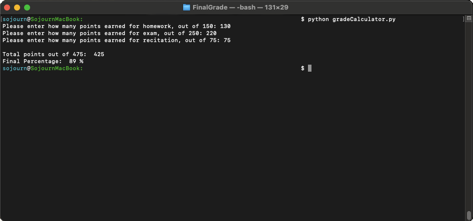

This program computes a final grade of 475 possible points using the following:
- Homework: 150 possible points
- Exams: 250 possible points
- Recitation: 75 possible points

The program can be run in the command line using:

```python gradeCalculator.py```

When run, the program will ask you to seperately enter the three different scores,
upon entering the 3rd score, it will use the 3 entered scored to compute a final
percentage and score out of 475.


