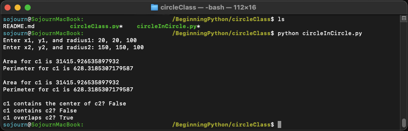

This program demonstrates Python classes. CircleClass.py defines a Circle2D class, which is then used by circleInCircle.py. CircleInCircle.py creates two Circle2D objects according to user input, and then tests if the first circle contains or overlaps the second circle. The program can be run in the terminal with ```python circleInCircle.py```. 

