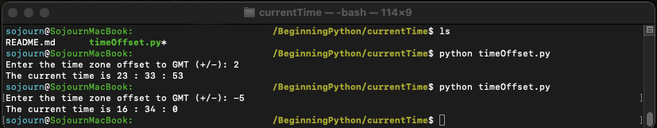

TimeOffset.py is a command line program that take in a positive or negative offset from the user, 
and computes the time offset from GMT according to that offset. The program can be run from the
command line with ```python timeOffset.py```

