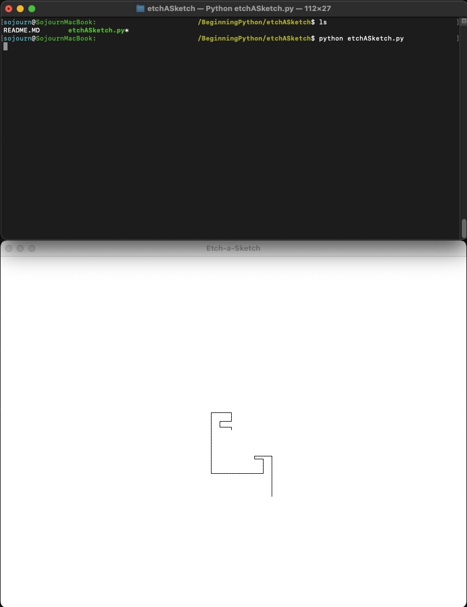

etchASketch.py is a command line program that when run will pop up another window. In the other window, 
users can use the arrow keys to draw and backspace to delete the previous drawn line. The program can 
be run from the command line with ```python etchASketch.py```

