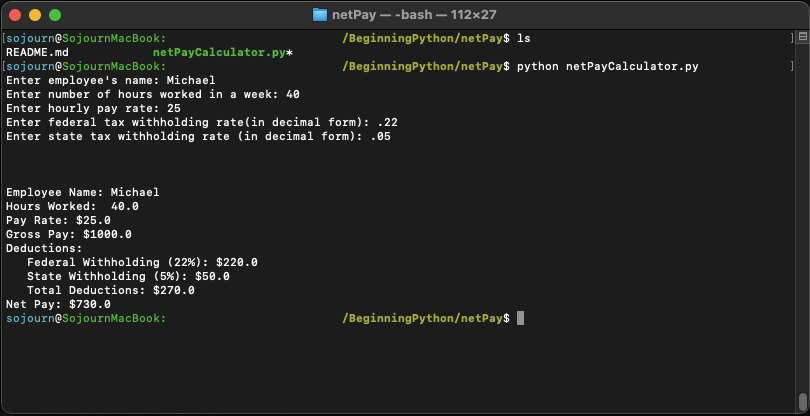

netPayCalculator.py is a command line program that computes a weekly net pay.
Users enter in their name, hours worked, pay rate, federal tax withholding rate, 
and state tax withholding rate. Using these numbers, the program will compute a gross
pay and minus the deductions to compute a weekly net pay.
 The program can be run from the terminal with 

```python netPayCalculator.py```. 


